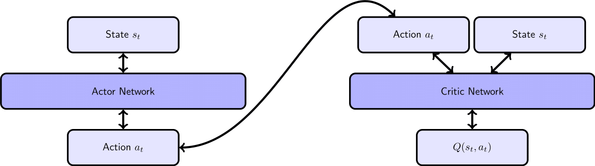
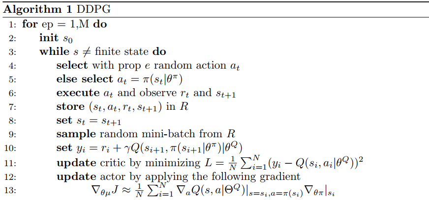

# Report

## Learning Algorithm

The algorithm implemented to solve this environment is `Deep Deterministic Policy Gradient`, which combines both `Q-learning` and `Policy gradients`. At its core, it uses a stochastic behavior policy for good exploration but estimates a deterministic target policy, which is much easier to learn. This is a `model-free`, `off-policy` actor-critic algorithm using deep function approximators that can learn policies in high-dimensional `continuous action spaces`.

## The Model

It primarily uses two neural networks, one for the actor and one for the critic. The critic is a Q-value network that takes in state and action as input and outputs the Q-value. 
 
 

* The Critic-Network consists of two hiddenlayer with Sigmoid activation.

* The Actor-Network consists of two hiddenlayers with relu activation. For the Output-layer a tanh-function is used in order to map the 	output the servo angles.

The following pseudocode shows the DDPG Algorithm by (Lillicrap et al., 2015).

 
 
The critic is trained by minimizing the bellman equation. But in contrast to Deep-Q-Learning it only outpus one Q-value per state-action pair. The actor on the other hand can be trained by directly applying the gradient.

`Enviornment`, `actions`, `state` and `reward` need to be defined:

##### The Environment

**Set-up:** Double-jointed arm which can move to target locations.
**Goal:** Each agent must move its hand to the goal location, and keep it there.
**Agents:** The environment contains 20 agents linked to a single Brain.
Agent Reward Function (independent):
+0.1 for each timestep agent's hand is in goal location.
**Brains:** One Brain with the following observation/action space.
* Vector Observation space: 33 variables corresponding to position, rotation, velocity, and angular velocities of the two arm Rigidbodies.
* Vector Action space: (Continuous) Each action is a vector with four numbers, corresponding to torque applicable to two joints. Every entry in the action vector should be a number between -1 and 1.
* Visual Observations: None.

**Reset Parameters:** Two, corresponding to goal size, and goal movement speed.
**Environment Solving Criteria:** The target for the agent is to solve the environment by achieving a score of +30 averaged across all 20 agents for 100 consecutive episodes.
The most straigh forward approach is to define the actions by a twelve dimensional vector.

##### **state-action spaces**

`Number of agents:` 20

`Size of each action:` 4

There are 20 agents. Each observes a state with length: 33

`The state for the first agent looks like:` [  0.00000000e+00  -4.00000000e+00   0.00000000e+00   1.00000000e+00
  -0.00000000e+00  -0.00000000e+00  -4.37113883e-08   0.00000000e+00
   0.00000000e+00   0.00000000e+00   0.00000000e+00   0.00000000e+00
   0.00000000e+00   0.00000000e+00  -1.00000000e+01   0.00000000e+00
   1.00000000e+00  -0.00000000e+00  -0.00000000e+00  -4.37113883e-08
   0.00000000e+00   0.00000000e+00   0.00000000e+00   0.00000000e+00
   0.00000000e+00   0.00000000e+00   5.75471878e+00  -1.00000000e+00
   5.55726624e+00   0.00000000e+00   1.00000000e+00   0.00000000e+00
  -1.68164849e-01]

#### **Hyperparameters**

| Parameter | Description | Value |
| --- | --- | --- |
| `GAMMA` | Discount factor | 0.99 |
| `TAU` | Soft update of target parameters| 1e-3 |
| `LR_ACTOR` | Learning rate for the actor | 1e-3 |
| `LR_CRITIC` | Learning rate for the critic | 1e-0 |
| `WEIGHT_DECAY` | L2 Weight decay | 0.0000 |
| `BATCH_SIZE` | Minibatch size | 128|
| `BUFFER_SIZE` | Size for memory buffer | int(1e6)|
| `LEARN_EVERY` | Learning timestep interval | 20 |       
| `LEARN_NUM` | Number of learning passes | 0.99 |

## Architecture

The model architecture is a neural network architecture consisting cascaded pairs of linear and non-linear layers.

For both the Actor and Critic, the size of the input linear layer is the state size, and the size of the output linear layer is the number of possible actions.

The output of the Actor is concatenated to the Critic's first layer output to be connected to the first hidden layer's input.

Following is the Neural Network architecture:

## Result

The agent was able to solve the 20 agent Reacher environment. The goal for the performance measure is an average reward of at least +30 over 100 episodes, and over all 20 agents.

## Future Improvement

**Prioritized Experience Replay:** as per DeepMind,` Prioritized Experience Replay` technique helps reduce the training time, improve the stability of the training process and is less prone to the change in hyperparameters.This could be tried in future.

**Experiment with other algorithms:** Trying different hyperparametrs of the DDPG algorithm required a lot of trial and error and so more time is needed. For example

* Increase number of training episodes
* Increase depth of each network, etc could be tried to see the model performance.

More robust algorithms like Trust Region Policy Optimization (TRPO), [Proximal Policy Optimization (PPO)](Proximal Policy Optimization Algorithms), or Distributed Distributional Deterministic Policy Gradients (D4PG) could be tried in future.

## References:
(Mnih et al., 2013), Playing Atari with Deep Reinforcement Learning

(Silver et al. 2014), Deterministic Policy Gradient

(Lillicrap et al., 2015), Continuous control with deep reinforcement learning

## Acknowledgments
I gratefully acknowled the Udacity DRLND course.

